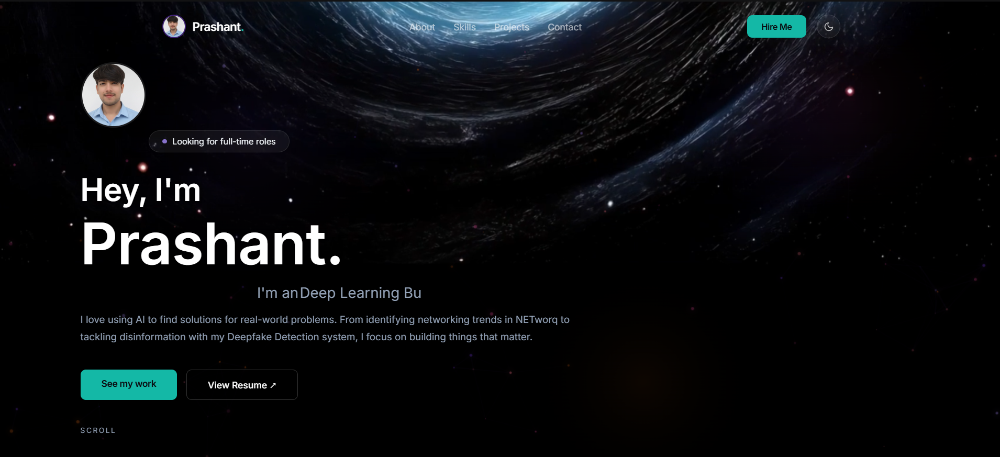
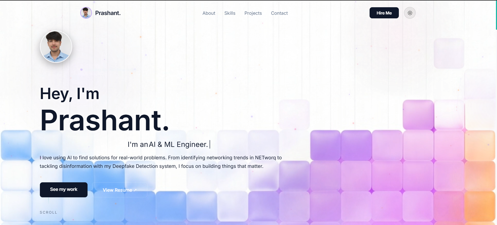

# Prashant Kumar - Personal Portfolio

This repository contains the source code for my professional portfolio website. Designed with a focus on minimalism and high performance, this site serves as a central hub for my technical projects, engineering capabilities, and professional experience in the Artificial Intelligence and Machine Learning domains.

**Live Demo:** [https://prashant-portfolio-nine.vercel.app/](https://prashant-portfolio-nine.vercel.app/)

## Visual Overview

The portfolio features a custom dual-video theme engine that smoothly transitions between a dark, space-oriented aesthetic and a clean, light geometric aesthetic.

### Dark Mode


### Light Mode


## Key Features

* **Dual-Video Theme Engine:** A custom-built theme toggle that dynamically crossfades between two distinct video backgrounds without interrupting playback or page performance.
* **Minimalist Architecture:** A typography-driven design utilizing the Inter font family, relying on solid colors, subtle glassmorphism, and structured grids rather than heavy UI components.
* **Dynamic Data Integration:** Live fetching and rendering of GitHub statistics, repositories, and contribution data using the GitHub REST API.
* **Compact Technical Showcase:** A highly organized, auto-fitting grid system to display technical proficiencies across languages, ML frameworks, data analytics tools, and backend infrastructure.
* **Responsive Design:** Fully fluid layout that adapts seamlessly across desktop, tablet, and mobile environments.

## Technical Stack

* **Backend:** Python, FastAPI
* **Frontend:** HTML5, CSS3 (Custom Variables & Grid/Flexbox layouts), Vanilla JavaScript
* **Animations:** Canvas API (Custom particle interactions), Intersection Observer API (Scroll reveals)
* **Deployment:** Vercel

## Local Development Setup

To run this portfolio locally, follow these steps:

1.  **Clone the repository:**
    ```bash
    git clone https://github.com/Prashant-core/portfolio.git
    cd portfolio
    ```

2.  **Create and activate a virtual environment (Optional but recommended):**
    ```bash
    python -m venv venv
    source venv/bin/activate  # On Windows use: venv\Scripts\activate
    ```

3.  **Install dependencies:**
    ```bash
    pip install fastapi uvicorn
    ```

4.  **Run the application:**
    ```bash
    uvicorn main:app --reload
    ```

5.  **View the site:**
    Open your browser and navigate to `http://127.0.0.1:8000`.

## Contact

For professional inquiries, collaboration opportunities, or to view my full resume, please reach out via the contact form on the live site or directly through my [LinkedIn profile](https://www.linkedin.com/in/prashant-kumar-49775029a/).

---
*Designed and built by Prashant Kumar.*
